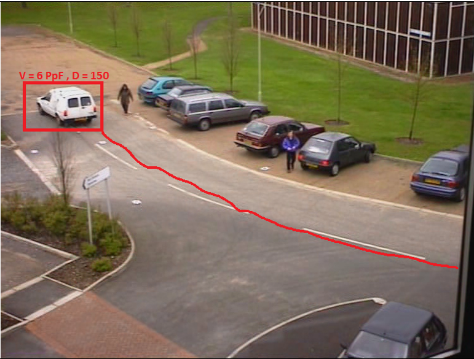

# Multiple-Vehicle-Tracking-
Multiple Vehicle Tracking using kalman-filters and Computer Vision ToolBox provided by matlab 

## Installation 
1-open terminal type
`git clone https://github.com/ahmedmagdy11/Multiple-Vehicle-Tracking-`  
2-open that folder in matlab  
3-Download [testcases](https://drive.google.com/drive/folders/1KIx61B-gj9SgQqiMjCxvYc0mCtZwsgd4)   
4-open Run.m file   
5- example `CarTracking(<INSERT VIDEO NAME HERE AS STRING>);` 

## expected output should be like this 

